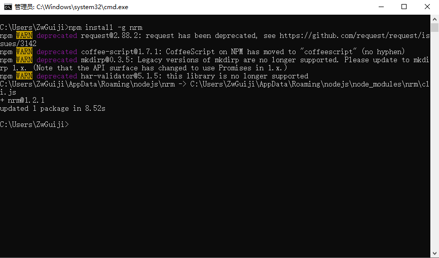
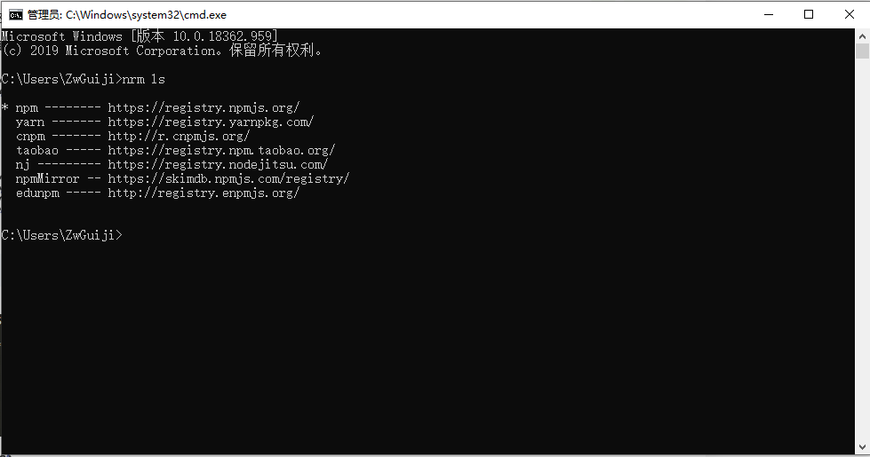
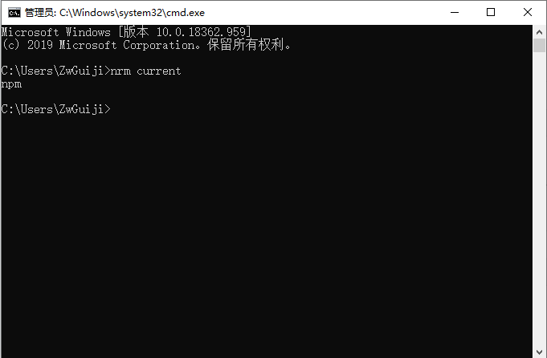
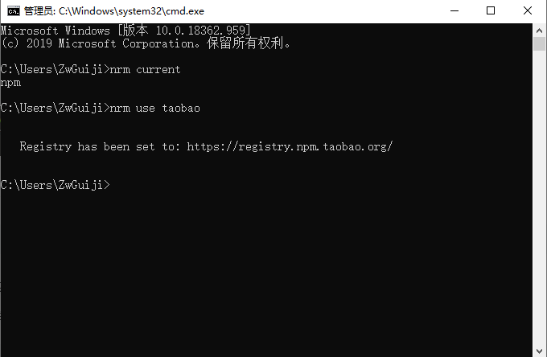
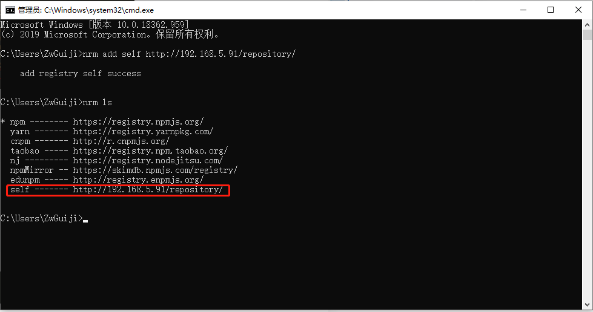
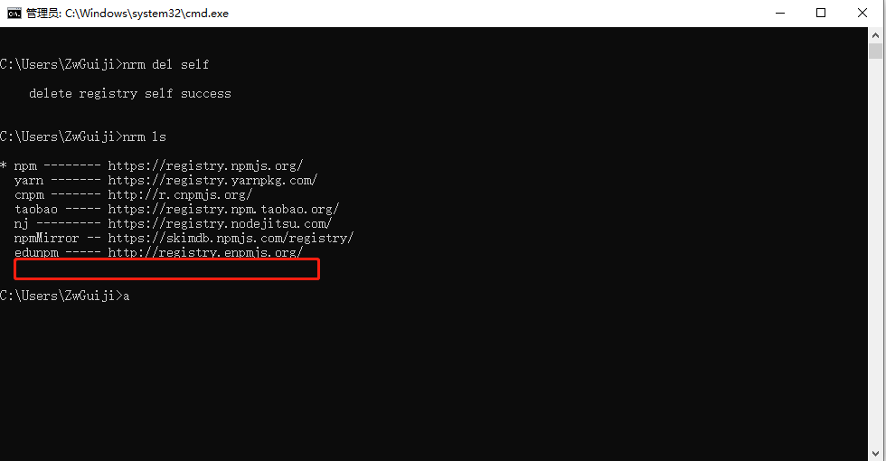
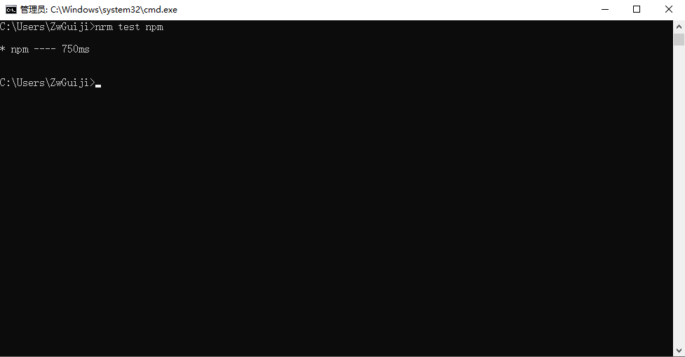
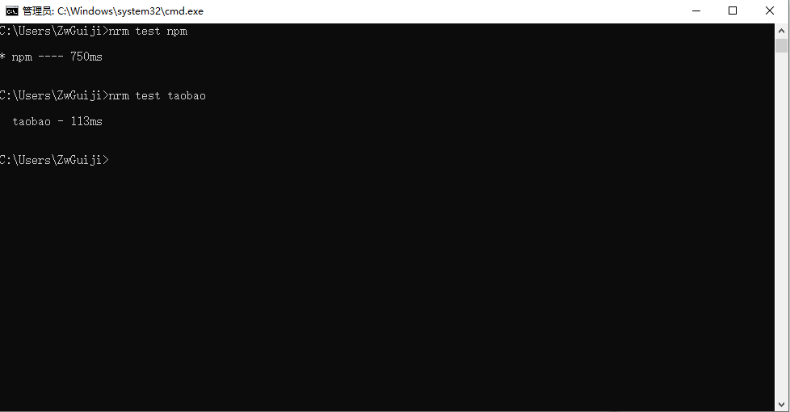

## 1、nrm介绍
nrm(npm registry manager )是npm的镜像源管理工具，有时候国外资源太慢，使用这个就可以快速地在 npm 源间切换

## 2、安装nrm
在命令行执行命令，npm install -g nrm，全局安装nrm。

```bash
npm install -g nrm
```



## 3、使用
执行命令nrm ls查看可选的源。

```bash
nrm ls
```



## 4、查看当前源

```bash
nrm current
```



## 5、切换
如果要切换到taobao源，执行命令nrm use taobao。

```bash
nrm use taobao
```



## 6、增加
你可以增加定制的源，特别适用于添加企业内部的私有源，执行命令 nrm add registry url，其中registry为源名，url为源的路径。

```bash
nrm add registry http://registry.npm.frp.trmap.cn/
```

随便添加一个测试一下，名称随意取。添加之后查看已经添加成功了。(虽然暂时不能用，但是公司有自己的镜像源就好办多了。)


## 7、删除
执行命令nrm del registry删除对应的源。

```bash
nrm del self
```

删除自己的创建的镜像源测试一下。删除完成后查看列表，self已经没有了。



## 8、测试速度
你还可以通过 nrm test 测试相应源的响应时间。

```bash
nrm test npm
```

查看npm的速度。


查看taobao的速度


