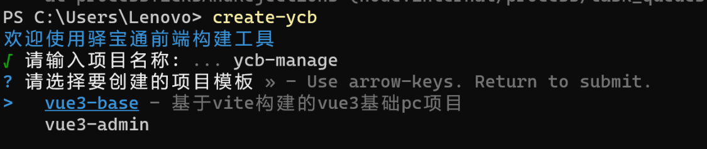

### 产生开发前端构建工具的背景

聊这个话题之前，你肯定会疑惑，为什么你会写一个属于自己的脚手架？

脚手架相比大家都不陌生，比如我们经常使用 **vue-cli**，**create-vite**，它可以帮助我们快速的初始化一个项目，无需从零配置，极大方便我们的开发。但强大是有限的，公共的脚手架有时并不能满足我们的实际开发

公司中已经积累了部分项目逻辑，例如工程化，公共方法、接口请求、项目架构等，如果此时公司新启一个项目，我们需要将原有项目的公共逻辑 **ctrl + c**，**ctrl + v**。

但这种复制粘贴的方式是存有很多缺点的:

- 重复性劳动，繁琐且浪费时间
- 容易忽略项目中的配置设置
- copy 过来的模板会存有重复代码

诸如此类，如果我们自己开发一套脚手架，自己定制自己的模板，复制粘贴的人工流程就会转换为 **cli** 的自动化流程

收获什么？

- 掌握开发基础脚手架的流程
- 学会使用命令行开发常用的多种第三方模块
- 拥有一个自己的脚手架

### 脚手架实现分析

我们以 **create-vite** 为例子，来分析一下简单脚手架需要具备的一些功能：

1. 运行创建命令
2. 交互式用户选择
3. 用户选择完毕后，根据用户选择生成用户需求的项目文件

### 开发流程分析

1.首先初始化一个项目

- 创建项目cli，配置项目所需的信息
- **npm link** 项目至全局，这样本地可以临时调用命令

  2.项目开发

- 基础指令配置: 例如 **--help --version** 等
- 复杂指令配置: **create** 指令
- 实现命令行交互功能: 基于 **prompts** 实现命令行交互
- 拉取项目模板
- 根据用户的选择动态生成项目

### 初始化cli项目

1. 创建 **cli** 文件夹，执行 **npm init -y** 初始化仓库，生成 **package.json** 文件
2. 在 **cli** 下创建 **bin** 文件夹，并在里面创建 **node** 入口文件 **enter**
3. 编辑 **enter** 文件，并将其配置到 **package.json** 中的 **bin** 字段

```javascript
// enter
#! /usr/bin/env node
// 为了方便测试
console.log("hello cli");

// package.json
// bin 字段也支持对象模式配置
"bin": {
    "ycb": "./bin/index.js"
 },
```

4. **npm link** 到全局
5. 运行 **ycb** 命令，命令行成功打印出 **hello cli**。 **cli** 项目配置成功。

### commander —— 命令行指令配置

第三方库 **commander** 来实现脚手架命令的配置。更多详细信息可以参考 [commander 中文文档](https://github.com/tj/commander.js/blob/master/Readme_zh-CN.md)

```javascript
import { program } from 'commander'

program.version('1.0.0').parse(process.argv)
```

### chalk —— 命令行美化工具

[**chalk**](https://www.npmjs.com/package/chalk)可以美化我们在命令行中输出内容的样式，例如实现多种颜色，花里胡哨的命令行提示等。

```javascript
const chalk = require('chalk')

console.log(`hello ${chalk.blue('world')}`)
console.log(chalk.blue.bgRed.bold('Hello world!'))
console.log(chalk.green(`I am a green line ${chalk.blue.underline.bold('with a blue substring')} that becomes green again!`))
```

### prompts —— 命令行交互工具

上面我们再使用 **create-vite** 命令时，其中有一个步骤是**交互式用户选择**，这个交互式功能就是由 **prompts** 实现的。
**prompts** 支持 Confirm 确认，List 单选，Checkbox 多选等多种交互方式。
这里我们来模拟实现 vue 的多选功能：

```javascript
import prompts from 'prompts'
;(async () => {
  const response = await prompts([
    {
      type: 'select',
      name: 'value',
      message: 'Pick a color',
      choices: [
        { title: 'Red', description: 'This option has a description', value: '#ff0000' },
        { title: 'Green', value: '#00ff00', disabled: true },
        { title: 'Blue', value: '#0000ff' }
      ],
      initial: 1
    }
  ])
  console.log(response)
})()
```

### ora —— 命令行 loading 效果

```javascript
const ora = require('ora')

const spinner = ora('下载模板中...')
spinner.start()
setTimeout(() => {
  spinner.succeed()
  spinner.fail()
}, 3000)
```

### fs-extra —— 更友好的文件操作

[**fs-extra**](https://github.com/jprichardson/node-fs-extra)模块是系统 **fs** 模块的扩展，提供了更多便利的 **API**，并继承了 **fs** 模块的 **API**。比 **fs** 使用起来更加友好。

### download-git-repo —— 命令行下载工具

[**download-git-repo**](https://gitlab.com/flippidippi/download-git-repo)可以从 **git** 中下载并提取一个 **git repository**。
**download-git-repo** 仓库提供 的 **download** 函数接收四个参数(下面代码是 download-git-repo 源码中截取的)

```javascript
/**
 * download-git-repo 源码
 * Download `repo` to `dest` and callback `fn(err)`.
 *
 * @param {String} repo 仓库地址
 * @param {String} dest 仓库下载后存放路径
 * @param {Object} opts 配置参数
 * @param {Function} fn 回调函数
 */

function download(repo, dest, opts, fn) {}
```

### 开发流程

1. 查看 **create-vite** 构建流程
2. 检测用户输入命令（文件名 or 空）

```javascript
program.on('command:*', ([cmd]) => {
  if (cmd) {
    checkUserDirectory(cmd)
  }
})

if (!process.argv.slice(2).length) {
  console.log(chalk.cyan('欢迎使用驿宝通前端构建工具'))
  getTemplateName()
}

program.parse(process.argv)
```

3. 获取用户输入目录名称

```javascript
export const getTemplateName = async () => {
  try {
    const { name } = await prompts(templateNameQuestion, cancel)
    if (name) {
      checkUserDirectory(name)
    }
  } catch (err) {
    console.log('err:', err)
  }
}
```

4. 检测用户文件夹是否重名 （重名=> 覆盖 or 重命名）

```javascript
const isHasSameDirectory = projectName => {
  const targetDir = path.join(process.cwd(), projectName)
  return fs.existsSync(targetDir)
}

export const checkUserDirectory = async name => {
  if (isHasSameDirectory(name)) {
    const { duplicateName } = await prompts(duplicateNameQuestion, cancel)
    if (duplicateName === 'overWrite') {
      const targetDir = path.join(process.cwd(), name)
      const spinner = ora(`正在删除 ${chalk.cyan(targetDir)}...`)
      spinner.start()
      try {
        await fs.remove(targetDir)
        spinner.succeed()
      } catch {
        spinner.fail()
      } finally {
        spinner.stop()
      }
      downloadTemplate(name)
    }
    if (duplicateName === 'rename') {
      const { newName } = await prompts(reNameQuestion, cancel)
      checkUserDirectory(newName)
    }
  } else {
    downloadTemplate(name)
  }
}
```

5. 下载模板

```javascript
const downloadTemplate = async projectName => {
  const spinner = ora('模版下载中 ...')
  const { features } = await prompts(templateQuestion, cancel)
  if (features) {
    const { link } = templateQuestion.choices.find(item => item.value === features)
    spinner.start()
    download(`direct:${link}`, `./${projectName}`, { clone: true }, err => {
      if (err) {
        spinner.fail()
        console.log(chalk.red('获取模版失败'))
      } else {
        spinner.succeed()
        console.info(chalk.green('下载模板成功~\n'))
        console.info(`cd ${projectName}`)
        console.info('npm install')
        console.info('npm run dev\n')
      }
      spinner.stop()
    })
  }
}
```

### 脚手架使用过程

1. 直接以管理员身份 打开“Windows PowerShell”，输入

```bash
Set-ExecutionPolicy -ExecutionPolicy Unrestricted
```

因为系统升级的原因，查看系统是否禁用了脚本） 回车 选择 “A”

2. 输入

```bash
npm create ycb --registry http://npm.ycb51.cn
```



3. 一步步 选择你需要的前端构建工具
