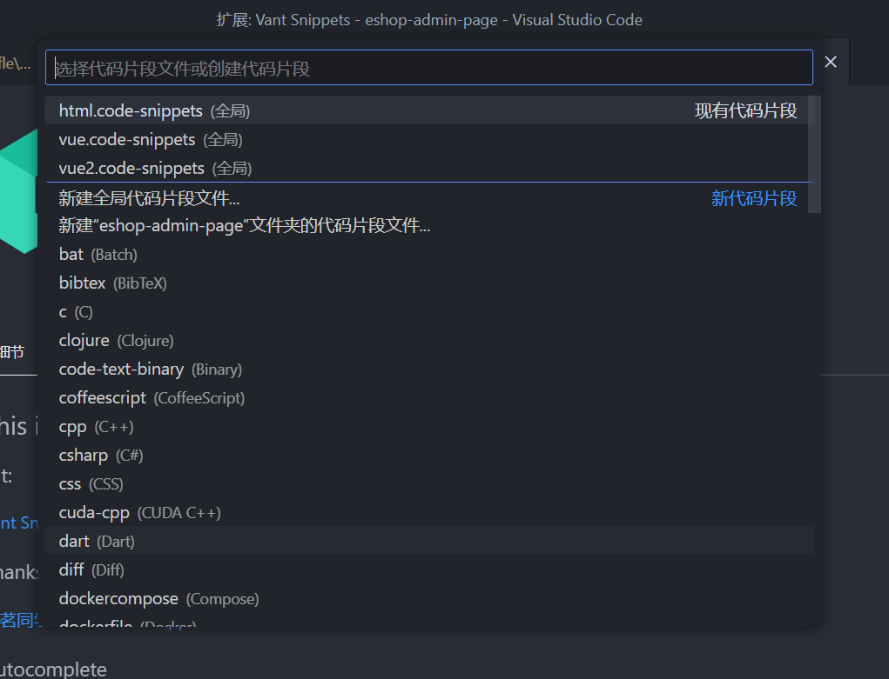
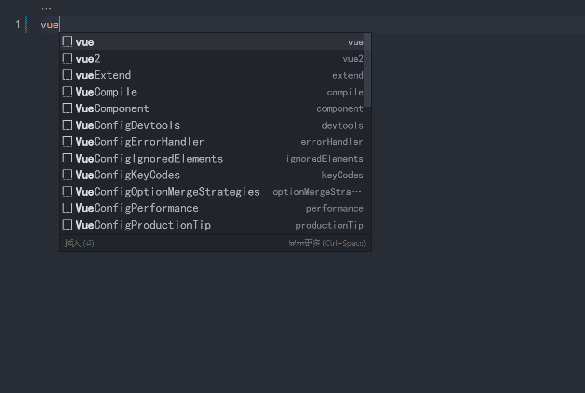

## 前言

VS Code 是前端开发者最佳的开发工具，你在开发中是否疲倦了从一个文件拷贝来新建一个文件呢？或者在你的团队内部是否有一些内部组件库，比如 Ant Design、 React hooks 等组件库，团队内部伴随开发的也一直打开组件相关文档？
其实我们可以开发一些常用的代码片段（Snippets）供团队内部使用。当输入前缀的时候就会触发智能提示。

## Snippets 插件库

#### [ES7 React/Redux/React-Native/JS snippets](https://marketplace.visualstudio.com/items?itemName=dsznajder.es7-react-js-snippets)

#### [Vue 3 Snippets](https://marketplace.visualstudio.com/items?itemName=hollowtree.vue-snippets)

#### [element-ui-snippets](https://marketplace.visualstudio.com/items?itemName=SS.element-ui-snippets)

#### [Vant Snippets](https://marketplace.visualstudio.com/items?itemName=fishku.vant-snippets)

## 创建代码片段

#### 点击设置-用户代码片段

#### 新建全局代码片段文件or新建项目文件夹代码片段

有一个网站可以帮助我们快速的创建 [code snippet](https://snippet-generator.app/)，访问网址粘贴代码就会生成code snippet格式的json，请注意，**prefix **字段为触发代码片段的关键字，输入你想触发的关键字，保存即可在编辑器中使用

#### 使用代码片段

输入关键词触发代码片段提示

点击即可生成对应的代码片段
