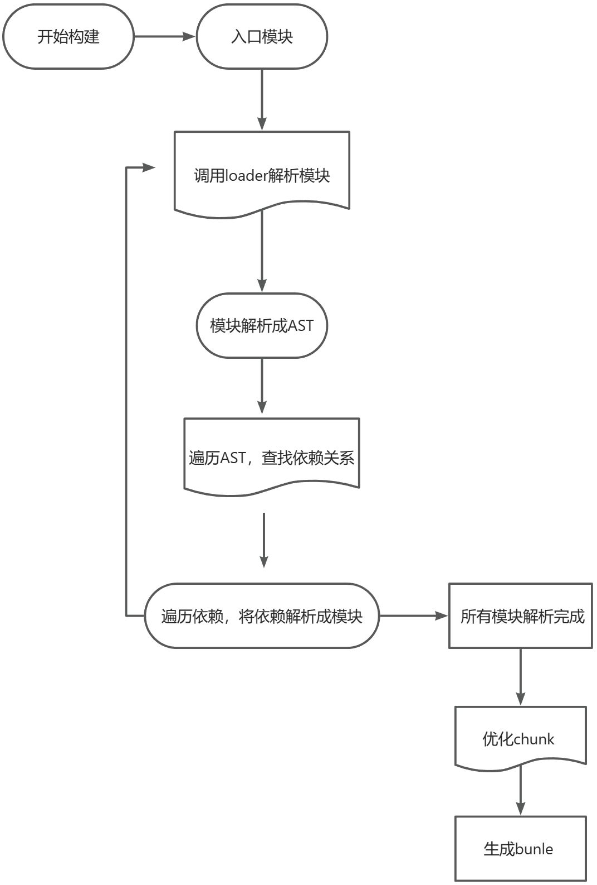
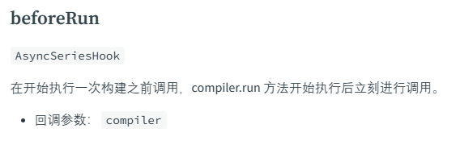
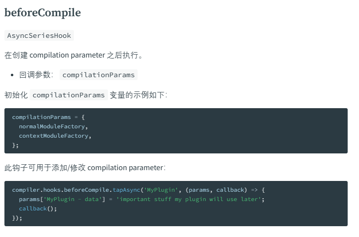

## 什么是插件

webpack 的设计理念是万物皆模块，然后将所有模块打包成一个或者多个 bundle 文件，但是这并不意味着 webpack 自身就能满足所有功能，比如 chunk 提取、代码压缩、css 文件提取等等，所以为了使 webpack 更加了灵活与便于拓展，webpack 设计了插件机制，通过插件可以实现各种拓展功能，满足业务需求

## 插件的定义

webpack 规定插件必须是一个 javascript 对象，且对象上必须有一个 apply 方法，这个 apply 方法会在 webpack 进行编译的时候进行调用，插件定义如下所示

```javascript
const pluginName = 'ConsoleLogOnBuildWebpackPlugin';

class ConsoleLogOnBuildWebpackPlugin {
  apply() {}
}

module.exports = ConsoleLogOnBuildWebpackPlugin;
```

到这里我们已经已经知道怎么定义一个 webpack plugin，虽然这个插件能过被执行，但是不会有任何作用，原因是插件内没有做任何处理，那么插件内怎么去介入 webpack 的构建流程，影响最终的构建结果呢？其实 webpack 在执行插件 apply 方法的时候，会传入一个 compiler 对象，这个 compiler 对象上会暴露 webpack 构建阶段不同节点的 hook，然后在这个 hook 上允许注册对应的 callback，如下所示

```javascript
const pluginName = 'ConsoleLogOnBuildWebpackPlugin';

class ConsoleLogOnBuildWebpackPlugin {
  apply(compiler) {
    // compiler.hooks 包含一组节点，这些节点，都允许注册对应的callback,webpack执行过程中，会调用这个callback，然后在这个callback
    // 调用的时候传入一些参数，然后callback内借助传入的参数修改webpack构建过程中的一些内容，最终影响webpack的构建结果
    compiler.hooks.run.tap(pluginName, (compilation) => {
      console.log('The webpack build process is starting!');
    });
  }
}

module.exports = ConsoleLogOnBuildWebpackPlugin;
```

webpack 构建流程可以简单总结如下图所示

那么 webpack 只要在处理的过程中，在各个阶段，执行我们注册的 callback，那么我们的插件就可以介入 webpack 构建流程，我们从 webpack 源码看下，webpack 是怎么触发我们注册的 hook callback 执行的

```javascript
const {SyncHook,SyncBailHook,AsyncParallelHook,AsyncSeriesHook} = require("tapable");

this.hooks = Object.freeze({
  /** @type {SyncHook<[]>} */
  initialize: new SyncHook([]),
  /** @type {SyncHook<[CompilationParams]>} */
  compile: new SyncHook(["params"]),
  /** @type {AsyncParallelHook<[Compilation]>} */
  make: new AsyncParallelHook(["compilation"]),
  ...
    });


compile(callback) {
  const params = this.newCompilationParams();
  // 调用beforeCompile hook，传入参数params, callback
  this.hooks.beforeCompile.callAsync(params, err => {
    if (err) return callback(err);

    // 调用compile hook，传入参数params
    this.hooks.compile.call(params);

    const compilation = this.newCompilation(params);

    // 调用compile hook 传入参数compilation, callback
    this.hooks.make.callAsync(compilation, err => {
      if (err) return callback(err);

      // 调用finishMake hook 传入参数compilation, callback
      this.hooks.finishMake.callAsync(compilation, err => {
        if (err) return callback(err);

        process.nextTick(() => {
          compilation.finish(err => {
            if (err) return callback(err);

            compilation.seal(err => {
              if (err) return callback(err);

              // 调用afterCompile hook 传入参数compilation, callback
              this.hooks.afterCompile.callAsync(compilation, err => {
                if (err) return callback(err);
                return callback(null, compilation);
              });
            });
          });
        });
      });
    });
  });
}
```

从源码我们可以看到，webpack 在编译的过程中，会在各个节点调用对应的 hook，从而执行对应的 callback，以达到功能拓展的目的

## compiler 钩子

目前webpack暴露的事件常见钩子，更多钩子请参见[webpack官网](https://webpack.docschina.org/api/compiler-hooks/)

##### entryOption

在读取配置的 entry 选项后触发

##### afterPlugins

在设置完初始插件后触发。

##### compile

在一个新的编译创建后，但在编译开始之前触发。

##### compilation

在创建 compilation 对象时触发。

##### make

在编译阶段开始时触发。

##### afterCompile

在编译阶段完成后触发。

##### emit

在生成资源到 output 目录之前触发。

##### afterEmit

在生成资源到 output 目录之后触发。

##### done

在编译完成时触发。

##### failed

在编译失败时触发。

#####

我们只需要每个 hook 代表执行的哪个阶段，并且该 hook 属于哪种类型的 hook 即可在插件中通过该 hook 注册 callback，完成对应的逻辑
如下图所示 我想在编译模块之前做些事情


```javascript
compiler.hooks.beforeRun.tapAsync('MyPlugin', (compiler, callback) => {
  /* 处理逻辑 */
	callback()
});
```

比如我想在模块解析之前做些事情


## 创建插件

webpack 插件由以下组成：

- 一个 JavaScript 命名函数或 JavaScript 类
- 在插件函数的 prototype 上定义一个 apply 方法
- 指定一个绑定到 webpack 自身的[事件钩子](https://webpack.docschina.org/api/compiler-hooks/)
- 处理 webpack 内部实例的特定数据
- 功能完成后调用 webpack 提供的回调

```javascript
// 一个 JavaScript 类
class MyExampleWebpackPlugin {
  // 在插件函数的 prototype 上定义一个 `apply` 方法，以 compiler 为参数。
  apply(compiler) {
    // 指定一个挂载到 webpack 自身的事件钩子。
    compiler.hooks.emit.tapAsync(
      'MyExampleWebpackPlugin',
      (compilation, callback) => {
        console.log('这是一个示例插件！');
        console.log(
          '这里表示了资源的单次构建的 `compilation` 对象：',
          compilation
        );

        // 用 webpack 提供的插件 API 处理构建过程
        compilation.addModule(/* ... */);

        callback();
      }
    );
  }
}
```

## 基本插件架构

插件是由「具有 apply 方法的 prototype 对象」所实例化出来的。这个 apply 方法在安装插件时，会被 webpack compiler 调用一次。apply 方法可以接收一个 webpack compiler 对象的引用，从而可以在回调函数中访问到 compiler 对象。一个插件结构如下：

```javascript
class HelloWorldPlugin {
  apply(compiler) {
    compiler.hooks.done.tap(
      'Hello World Plugin',
      (
        stats /* 绑定 done 钩子后，stats 会作为参数传入。 */
      ) => {
        console.log('Hello World!');
      }
    );
  }
}

module.exports = HelloWorldPlugin;
```

然后，要安装这个插件，只需要在你的 webpack 配置的 plugin 数组中添加一个实例：

```javascript
// webpack.config.js
var HelloWorldPlugin = require('hello-world');

module.exports = {
  // ... 这里是其他配置 ...
  plugins: [new HelloWorldPlugin({ options: true })],
};
```

## Compiler 和 Compilation

在插件开发中最重要的两个资源就是 [compiler](https://webpack.docschina.org/api/node/#compiler-instance) 和 [compilation](https://webpack.docschina.org/api/compilation-hooks/) 对象。理解它们的角色是扩展 webpack 引擎重要的第一步

```javascript
class HelloCompilationPlugin {
  apply(compiler) {
    // 指定一个挂载到 compilation 的钩子，回调函数的参数为 compilation 。
    compiler.hooks.compilation.tap('HelloCompilationPlugin', (compilation) => {
      // 现在可以通过 compilation 对象绑定各种钩子
      compilation.hooks.optimize.tap('HelloCompilationPlugin', () => {
        console.log('资源已经优化完毕。');
      });
    });
  }
}

module.exports = HelloCompilationPlugin;
```

compiler 和 compilation 以及其他重要对象提供的钩子清单，请查看 [plugins API](https://webpack.docschina.org/api/plugins/) 文档

## 创建自定义插件

### 插件分析

基于前面我们对 webpack 插件的介绍，我们分析一下我们目前要做的插件需求，我们需要分析项目中没有使用的资源，这个结果必须是构建完成才可以知晓，我们分析我们梳理的钩子，可选的钩子其实很多，这里我们选择 afterEmit 钩子来处理，输出 asset 到 output 目录之后执行 afterEmit 钩子，那我们初始化的函数就很明朗了

```javascript
class UnusedFilesWebpackPlugin {
  constructor(options) {
    this.options = options;
  }
  apply(compiler) {
    compiler.hooks.afterEmit.tap('UnusedFilesWebpackPlugin', async (compilation) => {

    });
  }
}

module.exports = UnusedFilesWebpackPlugin;
```

### 需求分析

基于我们要分析项目中未使用的资源，我们代码的思路需要实现以下几点

1. 设计插件需要的传参
2. 查找项目中全部使用的资源路径
3. 查找项目已使用的资源路径
4. 从全部依赖中过滤出未使用资源路径
5. 对未使用的资源进行类别分类
6. 输出未使用文件 json

## 创建项目

### 新建工程目录文件夹

```javascript
npm init
```

### 安装依赖

##### 添加 picocolor

picocolor 是一个轻量级的命令行颜色输出库，可以用于在控制台中打印有颜色的文本。它非常简单易用，只需要几行代码就可以将控制台输出变得更加美观
使用 picocolor 时，只需在要打印的文本字符串中添加标记即可指定颜色和样式。例如，在字符串中添加“{red}”标记就可以将文本颜色设置为红色。Picocolor 支持的颜色和样式有：黑、红、绿、黄、蓝、洋红、青、白，以及加粗、下划线等

```bash
pnpm add picocolors
```

##### 添加 node，ts 依赖

```bash
pnpm add @types/node tslib -D
```

##### 添加 rollup

Rollup 是一个 JavaScript 模块打包工具，它专注于将多个模块打包成一个或多个较小的文件。与其他常见的打包工具（如 Webpack 和 Parcel）相比，Rollup 的主要特点是其轻量级和高效性能
 Rollup 的一些主要特点

- Tree Shaking：Rollup 可以通过静态分析代码并识别未使用的部分，从而在最终的包中删除这些未使用的代码。这种优化技术称为 "Tree Shaking"，可以减少最终包的大小，提高性能
- ES6 模块支持：Rollup 原生支持 ES6 模块语法，可以直接处理 ES6 模块的导入和导出，而无需额外的配置。
- 插件系统：Rollup 提供了一个强大的插件系统，使开发者可以通过插件来扩展其功能。这些插件可以用于执行各种任务，如压缩代码、转换文件格式、处理 CSS 等
- 代码拆分（Code Splitting）：Rollup 支持将代码拆分为多个文件，通过动态导入（Dynamic Imports）实现按需加载
- 自定义输出格式：Rollup 支持将代码打包为多种不同的输出格式，包括 CommonJS、AMD、UMD 和 ES 模块等
- 高性能打包：由于 Rollup 的设计目标是专注于模块打包，其在性能方面表现出色。相对于其他大型打包工具，Rollup 的构建速度更快，生成的包也更小

```bash
pnpm add @rollup/plugin-babel @rollup/plugin-commonjs @rollup/plugin-node-resolve @rollup/plugin-terser @rollup/plugin-typescript rollup -D
```

##### package.json

```json
{
  "name": "unused-assets-webpack-plugin",
  "version": "0.0.1",
  "description": "查找项目中是否存在是否未使用的资源",
  "keywords": [
    "webpack-plugin",
    "unused-assets"
  ],
  "repository": {
    "type": "git",
    "url": "https://github.com/wgbx/unused-assets-webpack-plugin.git"
  },
  "homepage": "https://github.com/wgbx/unused-assets-webpack-plugin",
  "exports": {
    ".": {
      "require": "./dist/unused-assets-webpack-plugin.cjs",
      "import": "./dist/unused-assets-webpack-plugin.mjs"
    }
  },
  "main": "dist/unused-assets-webpack-plugin.cjs",
  "module": "dist/unused-assets-webpack-plugin.mjs",
  "scripts": {
    "build": "rollup --config ./rollup.config.mjs"
  },
  "author": "微光北下",
  "license": "MIT",
  "dependencies": {
    "picocolors": "^1.0.0"
  },
  "devDependencies": {
    "@rollup/plugin-babel": "^6.0.3",
    "@rollup/plugin-commonjs": "^24.1.0",
    "@rollup/plugin-node-resolve": "^15.0.2",
    "@rollup/plugin-terser": "^0.4.1",
    "@rollup/plugin-typescript": "^11.1.2",
    "@types/node": "^20.3.3",
    "glob": "^7.1.7",
    "rollup": "^3.21.5",
    "tslib": "^2.6.0"
  }
}
```

##### rollup.config.mjs

```javascript
import NodeResolve from '@rollup/plugin-node-resolve'
import commonjs from '@rollup/plugin-commonjs'
import babel from '@rollup/plugin-babel'
import terser from '@rollup/plugin-terser'
import typescript from '@rollup/plugin-typescript'

const name = 'unused-assets-webpack-plugin'

export default {
  input: './packages/index',
  output: [
    {
      name,
      file: 'dist/unused-assets-webpack-plugin.cjs',
      format: 'cjs',
      plugins: [terser()]
    },
    {
      name,
      file: 'dist/unused-assets-webpack-plugin.mjs',
      format: 'es',
      plugins: [terser()]
    }
  ],
  plugins: [
    NodeResolve(),
    commonjs(),
    babel({
      babelHelpers: 'bundled',
      exclude: 'node_modules/**'
    }),
    typescript({ outDir: 'dist/' })
  ],
}

```

### 构建代码

```javascript
const util = require('util');
const glob = util.promisify(require('glob'));
const path = require('path');
const log = require('picocolors')
const { writeFileSync } = require('node:fs')

class UnusedFilesWebpackPlugin {
  constructor(options) {
    this.options = options;
  }
  apply(compiler) {
    compiler.hooks.afterEmit.tap('UnusedFilesWebpackPlugin', async (compilation) => {
      const userOptions = { ...defaultOptions, ...this.options }
      const { output } = userOptions
      const unusedAssets = await findUnusedAssets(compilation, userOptions)
      const classificationFiles = classificationFile(unusedAssets, userOptions)
      setFile(classificationFiles, output)
    });
  }
}

const defaultOptions = {
  path: './src',
  output: './unused-files.json',
  exclude: []
}

async function findUnusedAssets(compilation, options) {
  const { path } = options
  const pattern = `${path}/**/*`
  const allFiles = await getAllFiles(pattern)
  const dependFiles = getDependFiles(compilation)
  return allFiles.filter(item => !dependFiles.includes(item));
}


async function getAllFiles(pattern) {
  try {
    const patternFiles = await glob(pattern, { nodir: true });
    return patternFiles.map(item => path.resolve(item))
  } catch (error) {
    console.log('getAllFiles Error:', error);
  }
}

function getDependFiles(compilation) {
  const { fileDependencies } = compilation
  const dependFiles = []
  fileDependencies.forEach(item => {
    if (!item.includes('node_modules')) {
      dependFiles.push(item)
    }
  })
  return dependFiles
}


function setFile(data, name = './unused-files.json') {
  writeFileSync(name, JSON.stringify(data, null, 2), (err) => {
    if (err) {
      log.red(`${name} 文件写入失败`)
    }
  })
}

function classificationFile(files, options) {
  const { exclude } = options
  const classifiedFiles = {};
  files.forEach((file) => {
    const extname = path.extname(file)
    if (!exclude.includes(extname)) {
      if (classifiedFiles[extname]) {
        classifiedFiles[extname].push(file);
      } else {
        classifiedFiles[extname] = [file];
      }
    }
  });
  return classifiedFiles
}

module.exports = UnusedFilesWebpackPlugin;
```

在 packages 下创建 index.js

```javascript
const util = require('util');
const glob = util.promisify(require('glob'));
const path = require('path');
const log = require('picocolors')
const { writeFileSync } = require('node:fs')

class UnusedFilesWebpackPlugin {
  constructor(options) {
    this.options = options;
  }
  apply(compiler) {
    compiler.hooks.afterEmit.tap('UnusedFilesWebpackPlugin', async (compilation) => {
      const userOptions = { ...defaultOptions, ...this.options }
      const { output } = userOptions
      const unusedAssets = await findUnusedAssets(compilation, userOptions)
      const classificationFiles = classificationFile(unusedAssets, userOptions)
      setFile(classificationFiles, output)
    });
  }
}

const defaultOptions = {
  path: './src',
  output: './unused-files.json',
  exclude: []
}

async function findUnusedAssets(compilation, options) {
  const { path } = options
  const pattern = `${path}/**/*`
  const allFiles = await getAllFiles(pattern)
  const dependFiles = getDependFiles(compilation)
  return allFiles.filter(item => !dependFiles.includes(item));
}


async function getAllFiles(pattern) {
  try {
    const patternFiles = await glob(pattern, { nodir: true });
    return patternFiles.map(item => path.resolve(item))
  } catch (error) {
    console.log('getAllFiles Error:', error);
  }
}

function getDependFiles(compilation) {
  const { fileDependencies } = compilation
  const dependFiles = []
  fileDependencies.forEach(item => {
    if (!item.includes('node_modules')) {
      dependFiles.push(item)
    }
  })
  return dependFiles
}


function setFile(data, name = './unused-files.json') {
  writeFileSync(name, JSON.stringify(data, null, 2), (err) => {
    if (err) {
      log.red(`${name} 文件写入失败`)
    }
  })
}

function classificationFile(files, options) {
  const { exclude } = options
  const classifiedFiles = {};
  files.forEach((file) => {
    const extname = path.extname(file)
    if (!exclude.includes(extname)) {
      if (classifiedFiles[extname]) {
        classifiedFiles[extname].push(file);
      } else {
        classifiedFiles[extname] = [file];
      }
    }
  });
  return classifiedFiles
}

module.exports = UnusedFilesWebpackPlugin;
```

1. 利用 afterEmit 钩子使用 glob 获取在参数文件夹下所有使用的文件
2. webpack 的 compilation 的 fileDependencies 会暴露出运行阶段所依赖的函数，过滤出不含 node_modules 的文件路径
3. 通过过滤筛选出未使用的文件路径
4. 基于筛选出的未使用文件，基于文件后缀进行数据分类，使用 node fs 进行文本输出
