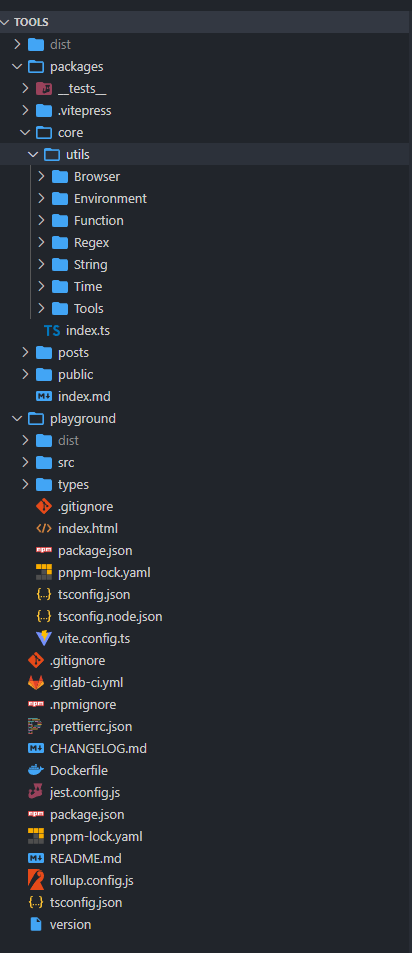

## 1.研讨目的

- 了解开源项目的架构
- 学习如何构建和使用 vitepress
- 理解并掌握 Jest 和 Playground 的作用和使用方法
- 过程中随时沟通，随时讨论

## 2.项目结构

开源项目的架构虽然各有特色，但是基本架构都是相似的。下图展示了一个典型的开源级别的Vitepress项目结构。通过深入学习这个结构，我们可以更好地了解开源项目的组织方式和工作流程

### md 目录结构

```markdown
tools/
├── .gitignore                     git忽略文件
├── README.md
├── package.json
├── packages/                      项目的源码包目录
│   ├── .vitepress/                viteperss编译文件
│   │   ├── config.js
│   │   ├── theme/
│   │   │   ├── Layout.vue
│   │   │   └── ...
│   │   ├── components/
│   │   │   ├── Button.vue
│   │   │   └── ...
│   │   └── dist/
│   │       └── ...
│   ├── guide/
│   │   └── index.md
│   ├── config/
│   │   └── ...
│   ├── README.md
├── tests/                         测试用例
│   └── example.test.js
│   ├── core/                      待编译源码
│   ├── posts/                     文章
│   ├── public/                    不需要编译的资源文件
└── playground                     代码演练场文件
└── npmignore                      npm忽略文件
└── .prettierrc.json               配置Prettier的格式化规则
└── CHANGELOG.md                   记录项目改动历史
└── dist                           编译代码
└── jest.config.js                 配置Jest的测试环境
└── rollup.config.js               配置Rollup的打包工具
└── tsconfig.json                  配置TypeScript的编译器设置
```

## 3.搭建环境

### 添加 VitePress

VitePress 是一个基于 Vue.js 的静态网站生成器，它可以用来快速搭建文档站点、博客等静态网站，基于 Vue 3 和 Vite 构建，它使用 Markdown 作为文档格式，并提供了一系列的主题和插件，可以快速构建美观、易于维护的静态网站。与其他静态网站生成器相比，VitePress 具有更快的构建速度和更好的开发体验
VitePress 的主要特点

- 快速构建
   - VitePress 基于 Vite，使用原生 ES 模块加载器，具有快速的热重载和开发体验
- 简单易用
   - VitePress 的文档使用 Markdown 格式编写，简单易读，易于维护
- 定制化
   - VitePress 提供了一系列的主题和插件，可以根据需求进行定制和扩展
- SEO 友好
   - VitePress 自动为每个页面生成静态 HTML 文件，并支持 SEO 优化
- 高度可配置
   - VitePress 的配置项非常灵活，可以通过配置文件进行自定义设置

```bash
npm init
pnpm add vitepress -D
pnpm vitepress init
```

在当前市场上，有两种主要的选择

- 一种是在大型项目框架中单独维护一个文档站点
- 另一种则是将文档站点集成到同一个项目中。对于工具类包而言，由于它们通常是独立的功能模块，集成在同一项目中可以方便地管理和维护

而我们的开发团队选择了方案二，将文档站点集成到了我们的工具包项目中。这样做的好处在于，不仅能够方便地管理和更新文档，还能够减少项目的冗余代码，提高开发效率

1. 创建 vitePress 结构

```
┌  Welcome to VitePress!
│
◇  Where should VitePress initialize the config?
│  ./packages
│
◇  Site title:
│  My Awesome Project
│
◇  Site description:
│  A VitePress Site
│
◆  Theme:
│  ● Default Theme (Out of the box, good-looking docs)
│  ○ Default Theme + Customization
│  ○ Custom Theme
```

在命令行中输入 "pnpm run docs:dev"，即可启动 Vitepress 并访问一个由 Vitepress 构建的静态站点生成 (SSG) 页面。这会加载默认的 index.md 文件，并将其转换为一个可浏览的网页，显示在浏览器中
可以在这个页面上添加或修改内容，以创建自己的自定义文档站点

### 添加 tsconfig.json

```json
{
  "compilerOptions": {
    "target": "es5",
    "module": "ES2015",
    "lib": ["ES2020", "DOM"],
    "esModuleInterop": true,
    "declaration": true,
    "forceConsistentCasingInFileNames": true,
    "strict": true,
    "noImplicitAny": false,
    "noImplicitThis": false,
    "skipLibCheck": true
  },
  "include": ["packages/core/"],
  "references": []
}
```

### 添加 core 源码

在 packages 下创建 core 目录，该项目存放项目方法源码，创建 index.ts

```typescript
/**
 * 获取 URL 中的查询参数
 * @param url 指定 URL 路径，默认为当前页面的 URL 地址
 * @returns 返回包含 URL 中查询参数的键值对的对象
 * @example
 * const url = 'https://example.com/?name=John&age=30';
 * const query = getQuery(url);
 * console.log(query);
 * // 输出：{ name: "John", age: "30" }
 */
export function getQuery(url = location.href) {
  let queryObj: { [key: string]: string } = {}
  new URL(url).searchParams.forEach((item, key) => {
    queryObj[key] = item
  })
  return queryObj
}
```

1. 维护一个公共方法中间件的好处有
   - 统一管理
      - 将常用的方法封装为中间件，可以让代码结构更加清晰，方便维护和管理
   - 提高复用性
      - 通过封装常用的方法为中间件，可以在不同的项目中重复使用这些方法，避免重复编写相同的代码
   - 减少错误
      - 对于经过严格测试和验证的中间件，可以减少代码错误的发生，提高代码的可靠性和稳定性
   - 方便协作
      - 通过维护公共方法中间件，可以让不同的开发者之间更容易协作，减少沟通成本，提高开发效
2. JSDoc 是 JavaScript 中一种常见的注释规范，它的好处如下
   - 自动生成文档
      - 通过使用 JSDoc 注释，可以自动生成代码的文档。这些文档可以包含函数、类、变量等的描述、参数、返回值等信息，方便其他开发人员理解和使用代码
   - 提供代码提示
      - JSDoc 注释提供了类型信息和描述，可以帮助编辑器或 IDE 更好地理解代码，并提供准确的代码提示、自动完成功能，提高开发效率
   - 支持静态分析工具
      - 许多静态分析工具（如 ESLint、TypeScript）可以解析 JSDoc 注释，并进行代码检查、类型检查等操作。这样可以在开发过程中发现潜在的错误、提供更好的代码质量保证
   - 提升团队协作
      - 通过使用统一的 JSDoc 注释规范，团队成员可以更好地理解彼此的代码，并快速了解代码的用途、参数、返回值等信息。这有助于提升团队协作效率和代码可读性
   - 文档化代码结构
      - JSDoc 注释可以对代码的结构进行描述，如类的继承关系、模块的导出等。这样可以更清晰地了解代码的组织结构，方便后续维护和扩展

### 添加 jest

Jest 是一个流行的 JavaScript 测试框架，主要用于编写单元测试、集成测试和功能测试。它被设计为简单易用，同时具有强大的功能和灵活的定制选项
以下是 Jest 的一些主要特点

- 简单易用
   - Jest 的 API 设计简洁明了，容易上手，适合编写各种规模的测试
- 自动 mocking
   - Jest 自动为 JavaScript 模块创建 mock，简化了对模块依赖的测试。
- 快速并行执行
   - Jest 可以并行执行测试，因此在大型项目中可以提高测试执行速度。
- 断言丰富
   - Jest 提供丰富的断言函数，包括匹配器（Matchers）和期望（Expect）语法，可以方便地编写清晰的测试断言
- 快照测试
   - Jest 支持快照测试，用于检查 UI 组件的渲染输出是否符合预期。
- Mock 函数
   - Jest 提供了丰富的 mock 函数功能，可以轻松模拟各种情况下的函数行为。
- 集成覆盖率报告
   - Jest 提供了集成的代码覆盖率报告功能，可以帮助开发者评估测试的覆盖范围。
- 快速启动
   - Jest 可以零配置运行，也支持通过配置文件进行进一步定制

1. 安装依赖

```typescript
 pnpm add jest ts-jest @types/jest -D
```

2. package.json 添加脚本命令

```json
  "scripts": {
    "test": "jest"
  },
```

3. 创建 jest.config.js 文件

```javascript
export default {
  preset: 'ts-jest',
  transform: {
    '^.+\\.tsx?$': 'ts-jest',
  },
  testRegex: '(/tests/.*|(\\.|/))\\.(test|spec)\\.tsx?$',
  moduleFileExtensions: ['ts', 'tsx', 'js', 'jsx', 'json', 'node'],
};
```

4. 基于规则，在 packages 下创建一个 tests 目录，创建一个 addNumbers.test.ts 文件

```typescript
function addNumbers(a: number, b: number): number {
  return a + b;
}

describe('addNumbers 函数', () => {
  it('两个正数相加', () => {
    expect(addNumbers(3, 5)).toBe(8);
  });

  it('一个正数和一个负数相加', () => {
    expect(addNumbers(-3, 5)).toBe(2);
  });

  it('两个负数相加', () => {
    expect(addNumbers(-3, -5)).toBe(-8);
  });

  it('两个小数相加', () => {
    expect(addNumbers(1.5, 2.5)).toBeCloseTo(4);
  });

  it('边界条件，0相加', () => {
    expect(addNumbers(0, 0)).toBe(0);
  });
});
```

5. package.json 添加 type 类型

```json
{
  "type": "module"
}
```

6. 运行命令调试

```bash
pnpm test
```

7. 添加 getQuery 的测试用例

```javascript
import { getQuery } from '../core/index';

describe('getQuery', () => {
  it('should return an empty object if there is no query string', () => {
    const url = 'https://example.com';
    expect(getQuery(url)).toEqual({});
  });

  it('should return an object containing query params', () => {
    const url = 'https://example.com/?name=John&age=30';
    expect(getQuery(url)).toEqual({ name: 'John', age: '30' });
  });

  it('should handle encoded query params', () => {
    const url = 'https://example.com/?name=John%20Doe&age=30';
    expect(getQuery(url)).toEqual({ name: 'John Doe', age: '30' });
  });
});
```

### 添加 playground

调试本地方法时，有一个演练场是非常方便的。在开发完成后，一个成熟的开源项目通常需要在本地测试完毕后再进行发布。因此，我们可以直接基于 Vite 创建一个项目，并在项目的根目录处创建一个演练场来进行调试

1. 创建项目目录

```bash
pnpm create vite playground --template vue
```

2. 启动项目

```bash
pnpm dev
```

3. 项目调试

在 App.vue 中，添加代码进行调试

```vue
<script setup>
import HelloWorld from './components/HelloWorld.vue'
import { getQuery } from '../../packages/core/index'
import { onMounted } from 'vue'

onMounted(() => {
  console.log(getQuery())
})
</script>
```

## 4.构建工具

在选择使用 Rollup 还是 Vite 时，需要根据具体的项目需求和特点来决定。以下是两种构建工具的特点：

- Rollup
  - Rollup 是一种 JavaScript 模块打包器，特别适用于构建小型、高性能的库和工具。它具有出色的 Tree Shaking 功能，可以消除未使用的代码，从而生成更小、更高效的输出文件。对于纯 JavaScript 项目，Rollup 提供了更好的性能和优化选项。如果项目的体积较小或者性能要求较高，那么 Rollup 可能是更好的选择
- Vite
  - Vite 是一种基于 ES 模块的构建工具，专门针对 Vue 开发而设计。它采用了现代的开发方式，利用原生 ES 模块在开发环境中实现快速的热重载，并且无需打包即可实时编译和加载模块。这使得在开发过程中的反馈速度更快，能够提高开发效率。此外，Vite 还支持快速解析和加载 Vue 单文件组件（SFC），进一步加速了开发过程。如果项目使用的是 Vue 框架，并且希望能够充分利用 Vue 生态系统的特性，那么 Vite 可能更适合你

实际情况下，哪种构建工具更适合你的项目取决于多种因素，例如项目的规模、所需的性能和打包体积等等。需要根据具体情况综合考虑，选择最适合的构建工具

### 配置 rollup

1. 安装依赖

```bash
pnpm add @babel/core @babel/preset-env @rollup/plugin-babel @rollup/plugin-commonjs @rollup/plugin-node-resolve @rollup/plugin-terser @rollup/plugin-typescript rollup tslib typescript -D
```

2. 创建 rollup.config.js

```javascript
import NodeResolve from '@rollup/plugin-node-resolve'
import commonjs from '@rollup/plugin-commonjs'
import babel from '@rollup/plugin-babel'
import terser from '@rollup/plugin-terser'
import typescript from '@rollup/plugin-typescript'

const name = 'tool'

export default {
  input: './packages/core/index.ts',
  output: [
    {
      name,
      file: `dist/index.js`,
      format: 'esm',
      // plugins: [terser()]
    }
  ],
  plugins: [
    NodeResolve(),
    commonjs(),
    typescript({
      outDir: 'dist/'
    }),
    babel({
      extensions: ['js', 'ts'],
      babelHelpers: 'bundled',
      exclude: 'node_modules/**'
    })
  ]
}
```

3. 添加编译信息

```bash
{
  "main": "dist/index.js",
  "types": "dist/index.d.ts",
  "scripts": {
    "build": "rollup --config ./rollup.config.js"
  },
}
```

4. 运行命令

```bash
pnpm build
```

### 配置文档站点

1. 修改 markdown-examples.md 内容

```markdown
---
title: Tools
---

# Tools
## getQuery

🎯获取 URL 中的查询参数

```typescript

/**
 * @func getQuery
 * @desc 获取 URL 中的查询参数
 * @param url 指定 URL 路径，默认为当前页面的 URL 地址
 * @returns 返回包含 URL 中查询参数的键值对的对象
 * @example
 * const url = 'https://example.com/?name=John&age=30';
 * const query = getQuery(url);
 * console.log(query);
 * // 输出：{ name: "John", age: "30" }
 */

```
```

2. 解析 config.mts

```markdown
import { defineConfig } from 'vitepress'

// https://vitepress.dev/reference/site-config
export default defineConfig({
  title: "My Awesome Project",
  description: "A VitePress Site",
  themeConfig: {
    // 导航链接
    nav: [
      { text: 'Home', link: '/' }, // 链接到首页
      { text: 'Examples', link: '/markdown-examples' } // 链接到示例页面
    ],

    // 侧边栏链接
    sidebar: [
      {
        text: 'Examples',
        items: [
          { text: 'Markdown Examples', link: '/markdown-examples' }, // 链接到 Markdown 示例页面
          { text: 'Runtime API Examples', link: '/api-examples' } // 链接到运行时 API 示例页面
        ]
      }
    ],

    // 社交链接
    socialLinks: [
      { icon: 'github', link: 'https://github.com/vuejs/vitepress' } // GitHub 链接
    ]
  }
})

```

## 5.发布与部署

1. 发布工具包

```markdown
yarn publish
```

2. vitepress 部署

```bash
pnpm docs:build
```

3. 查看 dist，dist 目录下

```bash
http-server
```
